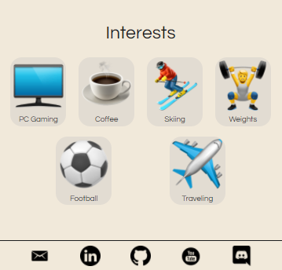

# 🌈dklein.io🌈
dklein.io is a personal website built to gain experience in NextJS as well as extend my resume for potential employers. 
Since it is super static, and focused on design and responsiveness, I had a lot of fun putting it together without the stress of state and complex logic.


## Features
### Fully Responsive UI


### View Banner Heading & Toggle Light Dark Themes


### View Project Portfolio

- Projects are broken into neat cards
- Cards contain image to encapsulate project
- Entire card either links to released project, or GitHub repo


### View Skills

- Skills are broken into small cards with hover effects


### View Interests and Connect Via Footer Links



## Getting Started

- Fork the repository and clone it on your local machine
- Install the dependencies by running `npm i` in the root directory
- Start the next development server with command 
```bash
npm run dev
# or
yarn dev
```
- Open [http://localhost:3000](http://localhost:3000) with your browser to see the result.

## Tech Stack

- [NextJS](https://nextjs.org/)

